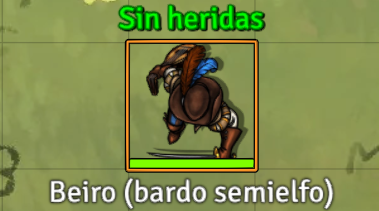
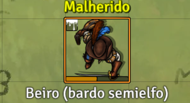
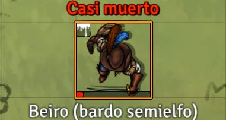
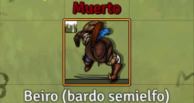
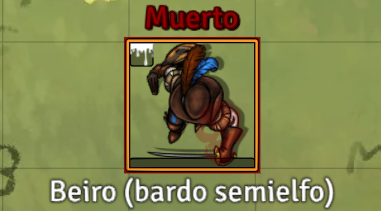
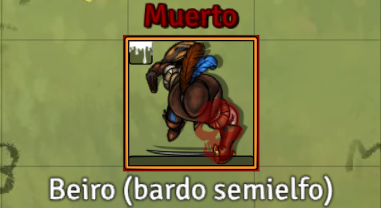
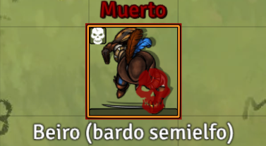

# 🇪🇸 D&D5e Death Token Effects


[](https://github.com/foundryvtt-sinregistrar/dnd5e-death-token-effects/releases/latest)
[](https://github.com/foundryvtt-sinregistrar/dnd5e-death-token-effects/releases/latest)
[](https://github.com/foundryvtt-sinregistrar/dnd5e-death-token-effects/releases)


Módulo para **Foundry VTT 14** y el sistema **D&D5e**.

Muestra el icono de muerte de D&D5e sobre el token cuando un actor está a **0 HP** y tiene fallos de salvación de muerte. También puede aplicar automáticamente el estado **Dead / Muerto** al llegar a 3 fallos y quitar **Bloodied / Ensangrentado** si existe.

> English documentation: see **README.en.md**.

---

## 📦 Compatibilidad

| Elemento | Versión |
|---|---|
| Foundry VTT mínimo | `14` |
| Foundry VTT verificado | `14.363` |
| Sistema | `dnd5e` |
| Versión del módulo | `1.14.0` |

---

## 🧭 Criterio de versionado

Este módulo usa el segundo número de la versión como referencia a la versión mayor de **Foundry VTT** compatible.

```text
1.14.0
│ │  └─ Parche / revisión del módulo
│ └──── Versión mayor de Foundry VTT objetivo: v14
└────── Versión mayor interna del módulo
```

| Versión | Significado |
|---|---|
| `1.14.0` | Primera versión pública para Foundry VTT v14 |
| `1.14.1` | Corrección o mejora menor para Foundry VTT v14 |
| `1.15.0` | Versión adaptada/verificada para Foundry VTT v15 |
| `2.14.0` | Cambio mayor interno manteniendo objetivo Foundry VTT v14 |

---

## ✅ Qué hace

```text
HP > 0
  → quita el icono superpuesto y el recuadro rojo

HP <= 0 y 0 fallos
  → no muestra icono por defecto
  → opcionalmente puede mostrar un icono muy tenue

HP <= 0 y 1 fallo de muerte
  → muestra el icono con transparencia baja

HP <= 0 y 2 fallos de muerte
  → muestra el icono con transparencia media

HP <= 0 y 3+ fallos de muerte
  → muestra el icono con transparencia alta
  → aplica el estado Dead / Muerto
  → quita el estado Bloodied / Ensangrentado si existe
```
---

## Vista previa

| Estado | Captura |
|---|---|
| Sin heridas / toda la vida |  |
| Malherido / mitad de vida |  |
| Casi muerto / 1 HP |  |
| Moribundo / 0 HP |  |
| 1 fallo de muerte |  |
| 2 fallos de muerte |  |
| 3 fallos / muerto |  |


---

## 🎨 Características visuales

El módulo:

- no sustituye la imagen original del token;
- dibuja el icono encima del token;
- mantiene el icono visualmente recto aunque el token esté rotado;
- coloca el icono en la esquina inferior derecha;
- aplica un margen interior de `3 px`;
- limita el tamaño máximo del icono al `50%` del token;
- añade un recuadro rojo alrededor de todo el token;
- usa elementos no interactivos para no bloquear el doble click sobre el token.

---

## ⚙️ Configuración

Ve a:

```text
Configure Settings → Module Settings → D&D5e Death Token Effects
```

Opciones principales:

| Opción | Recomendación |
|---|---|
| **Imagen superpuesta** | `systems/dnd5e/icons/svg/statuses/dead.svg` |
| **Color de la imagen superpuesta** | `#8B0000` |
| **Transparencia con 1 fallo de muerte** | `0.25` |
| **Transparencia con 2 fallos de muerte** | `0.50` |
| **Transparencia con 3+ fallos de muerte** | `0.80` |
| **Mostrar icono con 0 fallos** | Desactivado |
| **Ajustar imagen superpuesta a la cuadrícula del token** | Activado |
| **Tamaño del icono respecto al token** | `0.50` |
| **Aplicar estado Muerto con 3+ fallos** | Activado |
| **Quitar estado Ensangrentado al morir** | Activado |
| **Aplicar Muerto como overlay de estado** | Desactivado |
| **Quitar Muerto al recuperar HP** | Desactivado |

---

## 🧩 Rutas de D&D5e usadas

```text
system.attributes.hp.value
system.attributes.death.failure
```

Imagen por defecto:

```text
systems/dnd5e/icons/svg/statuses/dead.svg
```

Color por defecto:

```text
#8B0000
```

---

## 🚀 Instalación

### Opción 1 — Manifest URL

En Foundry:

```text
Add-on Modules → Install Module → Manifest URL
```

Pega:

```text
https://github.com/foundryvtt-sinregistrar/dnd5e-death-token-effects/releases/latest/download/module.json
```

### Opción 2 — Instalación manual

1. Descarga el ZIP de la release.
2. Descomprime el archivo.
3. Copia la carpeta `dnd5e-death-token-effects` dentro de:

```text
FoundryVTT/Data/modules/
```

En Docker/Windows puede ser algo parecido a:

```text
C:\docker\foundryvtt\foundryvtt-14\data\Data\modules\dnd5e-death-token-effects
```

4. Reinicia Foundry VTT.
5. Entra en tu mundo.
6. Activa el módulo desde `Manage Modules`.

---

## 🏗️ Release / Publicación

Este proyecto incluye una infraestructura de release similar al otro módulo:

- `dev-tools/buildScripts/build_release.py` genera el ZIP desde `git archive`.
- `.gitattributes` controla qué entra en el ZIP mediante `export-ignore`.
- `.github/workflows/release.yml` crea una release draft al subir un tag `v*`.
- Se suben dos ZIPs: `dnd5e-death-token-effects-<version>.zip` y `dnd5e-death-token-effects.zip`.

Flujo recomendado:

```bash
git status
python dev-tools/buildScripts/build_release.py --allow-dirty

# Para publicar una release real:
git add .
git commit -m "build(release): add release infrastructure"
git tag v1.14.0
git push origin main
git push origin v1.14.0
```

> Si `v1.14.0` ya existe en GitHub, sube la versión a `1.14.1` antes de crear el nuevo tag.

---

## 📂 Estructura

```text
dnd5e-death-token-effects/
├─ .github/
│  └─ workflows/
│     └─ release.yml
├─ dev-tools/
│  └─ buildScripts/
│     └─ build_release.py
├─ lang/
│  ├─ en.json
│  └─ es.json
├─ scripts/
│  └─ dnd5e-death-token-effects.js
├─ CHANGELOG.md
├─ DEVELOPER.md
├─ LICENSE
├─ README.en.md
├─ README.md
└─ module.json
```

---

## 📜 Changelog

Consulta **CHANGELOG.md**.

---

## 📜 Licencia

Este módulo se distribuye bajo la licencia indicada en **LICENSE**.

---

## 👤 Autor

```text
foundryvtt-sinregistrar
```
